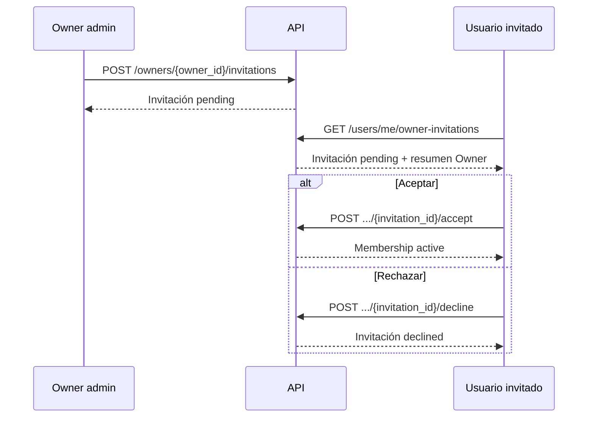

# Especificación de flujo User–Owner–Dataset para frontend

**Estado:** Aprobado para implementación frontend  
**Versión:** 1.0  
**Fecha:** 2026-09-09  
**Especificación conceptual relacionada:** [user-owner-dataset.md](user-owner-dataset.md)

## 1. Objetivo

Definir el flujo que debe implementar la aplicación web para que una misma
cuenta pueda consumir datos, proveer datos o hacer ambas cosas. El usuario
puede administrar uno o varios `Owner` mediante membresías contextuales y
recibir invitaciones dentro de la aplicación.

Este documento describe comportamiento observable por frontend: pantallas,
estados, contratos HTTP, permisos y criterios de aceptación.

## 2. Alcance de esta versión

Incluye:

- registro, sesión y preferencias de intereses del usuario;
- creación y administración contextual de un `Owner`;
- invitaciones persistidas en la aplicación;
- bandeja de invitaciones con acciones aceptar o rechazar;
- membresías y roles `owner_admin`, `owner_editor` y `owner_viewer`;
- creación, edición, publicación, suspensión y archivado de datasets;
- catálogo público, visibilidad y vista previa limitada;
- estados de carga, vacío, error y permisos insuficientes.

Fuera de esta versión:

- compras, checkout y suscripciones automáticas;
- concesión automática de acceso por compra, suscripción o promoción;
- envío real de emails de invitación;
- asignar acceso directamente a un usuario por `user_id` sin pasar por una
  invitación aceptada;
- directorio público de usuarios. La búsqueda de destinatarios está limitada a
  administradores del owner y devuelve solo cuentas activas coincidentes.

## 3. Modelo que debe conocer frontend

### 3.1 User

Cuenta autenticable. Un usuario puede no tener owners ni accesos de consumo.

Campos relevantes:

| Campo | Uso en interfaz |
|---|---|
| `id` | Identidad técnica; no se edita. |
| `email` | Inicio de sesión y contacto mostrado al propio usuario. |
| `full_name` | Identidad visible. |
| `status` | Solo `active` puede operar. |
| `interests` | Preferencias `consume`, `provide` o ambas; no son permisos. |

`interests` se persiste en el documento `users`, mediante `POST /users` al
registrarse y `PATCH /users/me` al modificarse.

### 3.2 Owner

Entidad proveedora de datos, de tipo `company` o `individual`. No es una
cuenta de acceso. Una persona natural puede tener un `Owner` separado de su
`User`.

### 3.3 OwnerMembership

Relación entre un `User` y un `Owner`. Es la única fuente de permisos de
administración sobre ese owner.

Roles:

| Rol | Capacidades principales |
|---|---|
| `owner_admin` | Editar owner, invitar y administrar miembros, crear/publicar/archivar datasets. |
| `owner_editor` | Crear y editar borradores, cargar/inspeccionar contenido propio. |
| `owner_viewer` | Consultar información interna y contenido permitido para inspección. |

Estados: `active`, `suspended`, `revoked`. Solo `active` concede permisos.
Frontend no debe inferir permisos desde `User.roles` o `User.interests`.

Cuando un `owner_admin` lista membresías en el contexto de un owner, la respuesta
incluye un resumen seguro del usuario (`user.id`, `user.full_name` y
`user.email`) para que la interfaz identifique a la persona sin mostrar el
`user_id` como etiqueta principal. El ID queda reservado para detalles técnicos
y soporte; otros roles reciben el contrato mínimo de membresía.

### 3.4 OwnerInvitation

Registro persistido en `owner_invitations`. No concede permisos mientras esté
pendiente.

Campos visibles:

| Campo | Descripción |
|---|---|
| `id` | Identificador de la invitación. |
| `owner_id` y `owner` | Owner emisor y resumen público (`id`, `name`, `type`). |
| `invited_user_id` | Destinatario registrado; no se solicita al aceptar/rechazar. |
| `role` | Rol ofrecido. |
| `status` | `pending`, `accepted`, `declined`, `expired`, `revoked`. |
| `expires_at` | Fecha de vencimiento UTC. |
| `invited_by_user_id` | Usuario emisor, para auditoría/presentación. |
| `created_at` | Fecha de creación. |

Solo `pending` vigente es accionable. `accepted`, `declined`, `expired` y
`revoked` son terminales. Una invitación aceptada crea la membresía; una
rechazada no crea ninguna.

### 3.5 Dataset

Producto de datos perteneciente a exactamente un owner. Su `owner_id` no cambia.

Estados: `draft`, `active`, `suspended`, `archived`.

Visibilidad: `public`, `unlisted`, `private`.

`public_preview_enabled` permite una muestra limitada para usuarios
autenticados en datasets activos `public` o `unlisted`; nunca concede descarga,
API ni acceso completo.

## 4. Navegación y pantallas

### 4.1 Usuario autenticado

La navegación debe mostrar, según el estado:

- **Inicio/catálogo:** datasets públicos activos.
- **Mis intereses:** edición de `consume` y `provide`.
- **Mis owners:** owners donde existe una membership activa.
- **Invitaciones:** contador y bandeja de invitaciones pendientes.
- **Perfil:** datos propios y verificación de email.

Un usuario puede ver la bandeja aunque no administre ningún owner.

Flujo principal de invitación:



### 4.2 Contexto de owner

Al entrar a un owner, frontend debe cargar membership y capacidades del usuario
para ese owner. No debe asumir que ser admin de un owner habilita otro.

Acciones visibles:

- `owner_admin`: editar owner, invitar, administrar miembros y gestionar
  datasets.
- `owner_editor`: crear/editar borradores.
- `owner_viewer`: consultar información interna.

Si no hay membership activa, no se muestra el panel interno.

### 4.3 Bandeja de invitaciones

Cada tarjeta muestra owner, rol ofrecido, emisor, fecha de creación y
vencimiento. Estados de la pantalla:

- **Loading:** skeleton o indicador de carga.
- **Empty:** “No tienes invitaciones pendientes”.
- **Pending:** acciones `Aceptar` y `Rechazar`.
- **Expired/terminal:** no aparece en la bandeja accionable; puede mostrarse
  como historial si el producto lo implementa.
- **Error:** mensaje recuperable y opción de reintentar.

Al aceptar, la tarjeta debe desaparecer o pasar a historial después de recibir
la nueva membership. Al rechazar, debe desaparecer sin crear membership.

## 5. Contratos HTTP para frontend

Todas las rutas usan prefijo `/api/v1` y requieren `Authorization: Bearer` salvo
que se indique lo contrario. El backend deriva el usuario actual del token.

### 5.1 Cuenta y sesión

| Acción | Método y ruta | Resultado |
|---|---|---|
| Registrarse | `POST /users` | `UserResponse`; acepta `interests`. |
| Iniciar sesión | `POST /auth/login` | Token Bearer. |
| Ver perfil | `GET /users/me` | `UserResponse`. |
| Actualizar perfil/intereses | `PATCH /users/me` | `UserResponse` actualizado. |

### 5.2 Owners y miembros

| Acción | Método y ruta | Permiso |
|---|---|---|
| Listar owners públicos | `GET /owners` | Público. |
| Ver owner público | `GET /owners/{owner_id}` | Público. |
| Crear owner | `POST /owners` | Usuario autenticado; crea membership admin inicial. |
| Actualizar owner | `PUT /owners/{owner_id}` | `owner_admin`. |
| Archivar owner | `DELETE /owners/{owner_id}?confirmation=true&reason=...` | `owner_admin`. |
| Listar miembros | `GET /owners/{owner_id}/members` | `VIEW_INTERNAL`. |
| Buscar usuarios para invitar | `GET /owners/{owner_id}/member-candidates?query=...` | `owner_admin`. |
| Cambiar rol/estado | `PATCH /owners/{owner_id}/members/{user_id}` | `owner_admin`. |

### 5.3 Invitaciones in-app

Crear una invitación desde el contexto del owner:

```http
POST /api/v1/owners/{owner_id}/invitations
```

```json
{
  "invited_user_id": "<id de usuario registrado>",
  "role": "owner_editor",
  "expires_at": "2026-10-01T00:00:00Z",
  "confirmation": false
}
```

Solo un `owner_admin` activo puede crearla. El usuario destinatario debe existir
y estar activo. Para `owner_admin`, `confirmation` debe ser `true`.

Bandeja del usuario autenticado:

```http
GET /api/v1/users/me/owner-invitations
```

Aceptar:

```http
POST /api/v1/users/me/owner-invitations/{invitation_id}/accept
```

Rechazar:

```http
POST /api/v1/users/me/owner-invitations/{invitation_id}/decline
```

El body de aceptar/rechazar es vacío. El backend toma siempre el destinatario
del token; frontend no debe enviar `user_id`. La cuenta debe tener email
verificado para aceptar.

Respuestas y errores esperados:

| Código | Significado para UI |
|---:|---|
| `200` | Operación completada. |
| `400` | Payload, fecha o identificador inválido. |
| `401` | Sesión ausente o inválida; redirigir a login. |
| `403` | Usuario no es destinatario o no tiene permiso. |
| `404` | Owner, usuario o invitación inexistente. |
| `409` | Invitación expirada/terminal, duplicada o membership existente. |
| `422` | Validación del contrato. |

No se envía email como parte de este flujo. La invitación se descubre al
consultar la bandeja o mediante el mecanismo de actualización que implemente
frontend posteriormente.

### 5.4 Datasets y preview

Frontend puede usar los endpoints existentes de datasets para catálogo y ciclo
de publicación:

- `GET /datasets`, `GET /datasets/{dataset_id}`;
- `GET /datasets/{dataset_id}/preview` para usuarios autenticados elegibles;
- `POST /datasets` para crear un borrador;
- `PUT /datasets/{dataset_id}` para editar/publicar según el rol;
- `DELETE /datasets/{dataset_id}` para archivar según el rol.

Crear un dataset siempre inicia en `draft` y exige `owner_id` de un owner donde
el usuario tenga permiso:

```json
{
  "title": "Indicadores de movilidad",
  "category": "transport",
  "owner_id": "<owner_id>",
  "visibility": "private",
  "publicPreviewEnabled": false,
  "description": "Descripción opcional",
  "tags": ["movilidad"]
}
```

`owner_id` es inmutable después de crear el dataset. El cambio de `draft` a
`active` requiere `owner_admin`; `owner_editor` puede guardar y editar el
borrador. Un dataset `suspended` o `archived` no se muestra como disponible para
consumo.

La respuesta pública contiene metadatos proyectados explícitamente (`id`,
`owner_id`, título, categoría, visibilidad, estado y campos descriptivos). No
debe asumirse que `samples`, ubicaciones de descarga o credenciales vienen en
el catálogo.

Para preview:

```http
GET /api/v1/datasets/{dataset_id}/preview
```

La respuesta tiene `datasetId`, `samples` limitados e `isLimited: true`. Solo
funciona para usuarios autenticados y datasets activos `public`/`unlisted` con
preview habilitado, salvo que el usuario ya tenga un permiso interno aplicable.

Si el dataset no está disponible para el usuario, mostrar estado bloqueado; no
tratar un `dataset_id` conocido como autorización.

Los endpoints de compras, suscripciones y concesión directa de acceso por
`user_id` NO forman parte del contrato frontend de esta versión.

## 6. Reglas de UX y seguridad

1. El token es la única fuente de identidad para acciones sobre la bandeja.
2. No mostrar invitaciones de otro usuario aunque se conozca su ID.
3. Deshabilitar el botón mientras una decisión está en curso y refrescar la
   bandeja después de un `200`.
4. Ante `409`, refrescar la invitación y explicar que otra decisión o el
   vencimiento la dejó no disponible.
5. No renderizar controles administrativos antes de cargar la membership del
   owner.
6. Tratar `interests` como preferencias; nunca como autorización.
7. No mostrar secretos, credenciales, ubicaciones privadas ni muestras fuera de
   los scopes autorizados por el backend.
8. Fechas mostradas localmente; fechas enviadas al backend en ISO-8601 UTC.

## 7. Criterios de aceptación frontend

- Un usuario con `interests: ["consume"]`, `["provide"]` o ambas puede navegar
  sin que la selección oculte capacidades autorizadas.
- Crear un owner deja visible al creador como `owner_admin`.
- Un admin puede emitir una invitación a un usuario registrado y ve confirmación
  de creación, sin prometer entrega de email.
- El destinatario ve la invitación en su bandeja sin visitar un enlace externo.
- Aceptar crea la membership y habilita inmediatamente el contexto del owner.
- Rechazar elimina la invitación de pendientes y no habilita el owner.
- Un segundo click o dos pestañas concurrentes no crean dos memberships.
- Un usuario no destinatario no puede aceptar ni rechazar la invitación.
- Invitaciones vencidas, owners no activos y cuentas no activas no aparecen como
  acciones disponibles.
- Las membresías muestran nombre y correo como identidad principal; el
  `user_id` solo aparece dentro de los detalles técnicos.
- Un usuario puede ser proveedor y consumidor simultáneamente, con permisos
  evaluados de forma independiente.

## 8. Decisiones pendientes para una versión posterior

- historial visible de invitaciones terminales;
- notificaciones push o email;
- compras, suscripciones y emisión automática de entitlements;
- UX de concesión manual de acceso cuando exista el flujo de negocio aprobado.
